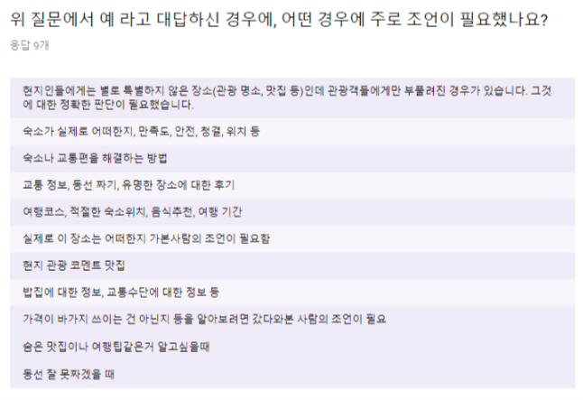

# DP1 Report
* Team name : IKs
* Team member : Kyungmo Kim, Hajun Kim, Minyeop Choi, Yoseph Kurnia Soenggoro

## Experiences
Before travelling, backpack travelers' tend to be burdened by several aspects within their planning phase. In general, those burdens are: time, cost, stress. In order to improve the travelling experience, it is essential to reduce the burdens within the planning process. 

By observing the latest trend, it could be seen that numerous Korean young adults are going backpack travel the world in a fast pace. Therefore, we will focus on reducing the burden of people who travel more frequently than one in six months. 

## Observation
### Interview Question
* Questions to categorize users
    1. How frequently do you travel?
    1. Where do you want to go?
    1. What are your motivations for travelling?
    1. What are your expectations for travelling?
* Questions to find insights
    1. How much time do you spend preparing your trip?
    1. What is your expectation from travelling?
    1. What process takes the most time when you prepare for your trip?
    1. Which services do you use for travelling?
    1. What kind of inconveniences you experienced while using lots of other traveling apps or web services?
    1. Did you feel like somebody else’s comments about places where you want to go useful enough?
    1. How much money are you planning to spend?
    1. Suppose you are traveling in some foreign country. Can you show or explain us how do you find where you want to stay today?

### Interviewee
|Interviewer            |Country|Age|Frequent           |Characteristic|
|-----------------------|-------|---|-------------------|--------------|
|Kyungmo Kim            |Korea  |22 |Twice a year       |              |
|Minyeop Choi           |Korea  |22 |Once a month       |Extreme user  |
|Hajun Kim              |Korea  |22 |Once a year        |              |
|Yoseph Kurnia Soenggoro|Korea  |25 |Once every 3 months |              |

Online survey (10 people)

  

[Online survey link](https://goo.gl/forms/xRU3VWRuGyQMNqAi2)

### Interesting monents
1. When Yoseph asked his interviewee whether if trip advisors were useful, he replied, "As an extreme user, planning for a trip is not hard. I don't think trip advisors are necessary." It turns out that extreme travelers don't feel the need for trip advisors. 
2. Hajun improvised a contextual inquriry and asked his interviewee to plan the entire route for traveling to Chungnam Boryeong. He started by turning on a text editor and repeated searching and writing down where he wants to visit. When he finished writing down, he tried to find the optimized path, but he was completely stuck because there were too many things to consider in terms of time, way and cost.

## Needs
1. Need to reduce time packaging luggage.
1. Need to reduce time planning on traveling route.
1. Need integrated information for reliability
1. Need safety while travel
1. Need an up-to-date information
1. Need to summarize the information
1. Need to translate local information
1. Need some ways to incorporate opinions while planning to trip with other people.
1. Need some information for niche place to trip
1. Need an immersive experience for their trip

## Insights
1. Information given in the internet tends to be relatively subjective, unreliable, and not up-to-date
1. Travel spending tends to be not very certain
1. Depending on the platform, price for traveling varies too broadly
1. There are too many websites which serve information about trip
1. The websites which serve accurate information is mostly in local language
1. Extreme users not willing to need for advises
1. They need trip advisor
1. People feel that the more people accompanied, the more burden while preparing for a trip
1. People who are not familiar with trip spend too much time while preparing
1. People who have never been made a plan for trip do not willing to ask advices to someone

## Feedback
1. Need some interviewers towards the upper age limit of your target users
    * Answer : It is certainly a very good suggestion that might benefit the design process for the project. However, the time given in executing the work is very limited, therefore only those which have a close relationship with the members are able to be interviewed.
1. Need to specify target users.
    * Answer : The members already decided to specify the frequency of travel from once every six months to a more frequent basis.
1. Need to interview towards the upper age limit of your target user. 
    * Answer : It is true that our interviewee’s age range was too narrow. Therefore, we will conduct some more interviews for more broad age range.
1. Need an acknowledgement of preexisting solutions and some insight as to why these needs persist despite the fact.
    * Answer : Problem of preexisting solutions (such as ‘my real trip’ or ‘trip advisor’ is that information on these platforms is not reliable and outdated. To obtain updated and reliable information, we will serve information made by people who live in that country. 
1. Need a more detailed explanation of the process how needs and insights comes
    * Answer : Need and insight is made based on our interview results. Next time, it will be better using empathy map to categorize interview result to obtain needs and insights
