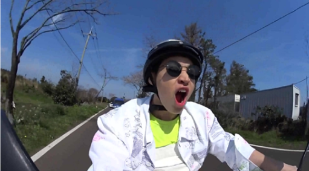
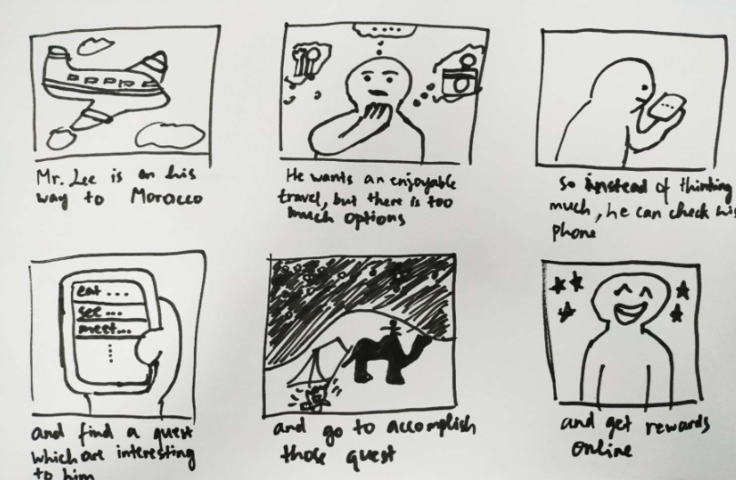
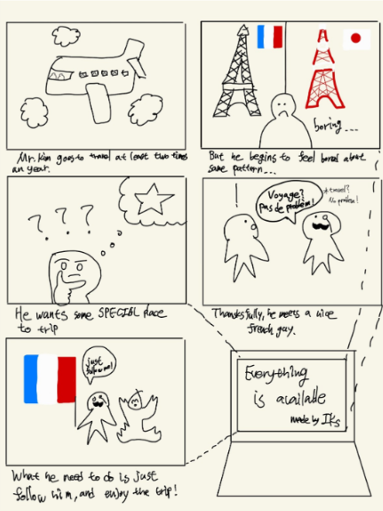
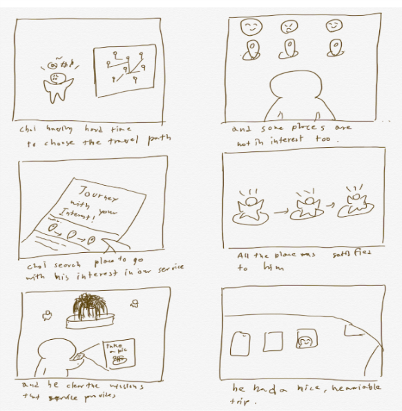

# DP2 Report
* Team name : IKs
* Team member : Kyungmo Kim, Hajun Kim, Minyeop Choi, Yoseph Kurnia Soenggoro

## POV
**Travelers need to get memorable, niche and immersive of experiences from traveling, rather than just visiting a certain area and do something which is trivial(e.g. Sightseeing, enjoy the meal) because frequent travelers often feel sick with the same pattern.**

## Persona

* Korean
* 27 years old
* Living in Seoul
* Working for a public enterprise in Korea
* Visited many foreign countries
* Travel more than three times a year
* Have more than 500 friends in Facebook
* Likes to share memorable moments with friends
* Enjoys bike riding, hiking and swimming during the weekend

#
#
HMW
### Selection Process
We tried to come up with as much as possible HMWs by brainstorming for 20 minutes and made discussions about how to refine our HMWs. We used Google Docs as a tool for brainstorming. After fixing our HMWs, we voted to choose three best HMWs.

### HMW
* HMW redesign planning trip experience to be more enjoyable as if one is now living in a whole new world?
* HMW redesign planning trip experience to be more efficient in terms of time and money?
* HMW take a survey about niche places to local people, and introduce to travelers?
* HMW give chances for our users to dive into local environment?
* HMW make travelers to have more interaction with local people?
* HMW assign a virtual guide for a specific location to each traveler?
* HMW provide some quizzes or missions related to local place?
* HMW make recommendations of the trip more clear based on their characteristics?
* HMW serve information made by local people, not travelers?
* HMW design a game-like system to make traveling more enjoyable?
* HMW make traveler feel rewarded as their journey goes through?

### Top 3 HMW
* HMW redesign planning trip experience to be more enjoyable as if one is now living in a whole new world?
* HMW assign a virtual guide for a specific location to each traveler?
* HMW design a game-like system to make traveling more enjoyable?

### Why?
The result is based on our vote so it's hard to explain, but we  think this is because our top 3 HMWs are unique and fresh compared to others. First one is trying to focus on an immersive environment itself, and the second one is about directly helping travelers to have more engaging and interactive experience. The third one is about a system, or a structure which is suitable for niche and rewarding traveling.

## Solution
### Selection Process
We also did brainstorming and voting for coming up with three best solutions. The entire process took about an hour. 

### HMW redesign planning trip experience to be more enjoyable as if one is now living in a whole new world?
1.  Give a user some quests to complete, which is similar to a real game. If the user completed them, rewards will be given.
2.  Give experiences like a player living in an open world game. Make players to travel around freely by following clues and look out for interesting local events.
3.  Let a local travel guide help user decide the place to go.
4.  Find other people online with similar travelling destination to go and travel together.
5.  Create an environment where local people can be more open-minded to users so that users can immerse themselves with the existing local communities and live with them as if he/she is a part of it.
6.  Show the user the total point (standards can vary, basically on activity, and other users’ opinion.) that she/he have earned from the trip, such that the user can compare the score with other travelers.
7. Show other people’s picture to user in order to show how other travelers enjoy their trip with the same place.
8.  Encouraging cultural exchange (might be a little bit stressful for the users): introducing the user’s hometown unique objects, musics, or tradition with the local communities as an exchange of hospitality.
9.  Enforce speed travelling: under certain time constraint, travelers can explore more destinations (might increase stress but probably in somehow enjoyable way)
10.  Native offers the place to sleep to user, and in addition to that, natives can go to travel along with the user.

### HMW assign a (virtual) guide for a specific location to each traveler?
1.  Give a digital pamphlet providing information about the local place.
2.  Connect with an officially approved local people as a personal travel guide such as the model of Uber taxi service. The guide might be paid or create careers as a travel guide. 
3.  Conduct online surveys to the local residents, and introduce high-rated places to users.
4.  Show the users the available local travel guide that matches the chosen preferences and let the users choose based on the rating systems and comments given by previous users.
5.  Use AI to describe the travel locations and suggest travel routes based on the traveler’s behavioral pattern.
6.  Show pictures of other people who went to a similar trip before. It can make user naturally get to know where or what is enjoyable in the tourist attraction.
7.  Give unique advices on how local people enjoy the tourist attraction.
8.  Create a platform where users can provide audio explanations (similar to using an audio book) that can be heard by other users while he or she is walking around.
9. Create a platform for local taxi drivers so that they can work also as a travel guide. This is because taxi drivers might possibly know a lot about the site. 
10.  Recommend the user to meet with a specific person that might improve one’s travel experience (e.g. Introduce a chef for who wants to cook and eat local food by oneself)

### HMW design a game-like system to make traveling more enjoyable?
1.  Give step by step missions along the traveling path.
2.  Let users participate creating goals in the online community for each site based on their experiences.
3.  Give challenging missions or messages so that the users feel like the entire travel was meaningful.
4.  If a user sets up main goal for the trip and then the system can create some following subgoals to achieve that main goal. The player can naturally follow the storyline then.
5.  Give a video game-like story as the basis for the user’s travel journey.
6.  After the user finishes goals step by step, reward with contribution points(e.g.honor points or souvenir of some kind) based on Likes others in the community give.
7.  Induce users to take pictures of themselves in tourist attraction to fill in the form.
8.  At first, hide details about what exactly what the traveler would experience and as the travel goes through, it reveals lots of other hidden quests that can be challenging.
9.  Plan the journey as stages based on the cities they will visit and suggest them missions based on purposes, preference or hobbies. Chosen before the trip.
10.  Give rewards for passing through tiresome process. (E.g. If the traveler just passed the airport, the traveler might be very tired, so the system can give encouraging messages or rewards for it)

### Top 3 Solutions
*   Give a user some quests to complete, which is similar to a real game. If the user completed them, rewards will be given. Games are fun!
*  Connect with an officially approved local people as a personal travel guide such as the model of Uber taxi service.
* Plan the journey as stages based on the cities they will visit and suggest them missions based on purposes, preference or hobbies. Chosen before the trip.

### Why?
We choose each solution from each HMW question. Even though these three solutions are very distinct, they are somehow related to each other to create a combined, incorporated solution. We can create a game-like system which encourages travelers to freely clear stages and missions based on their preferences. In addition, while travelers are breaking through their missions, they might face local guides to help them complete their missions.

## Storyboards

## Feedback
1. I wish the solution with the guide would explain a bit more how the guide is motivated to participate.
* Answer : We added some more details about how we can reward local guides for participation. Local guides can directly be paid or can create careers as an expert traveler guide. 
2. I wish the user was more specific and special.
* Answer : We added more details about our persona(motivations, preferences and goals).
3. I wish to see a specific POV, I thought ‘repetitive’ means booking, buying a ticket, planning, etc.
* Answer : We changed our POV sentence to make its meanings a bit more clear.
4. I wish you to make 1st and 3rd HMW more distinguishable.
* Answer : We decided to focus on game-like system instead of a general meaning of a system. 
5. What if the third storyboard is drawn with a thicker pen so it is more readable?
* Answer : We draw our storyboard with a thicker pen again.
6. What if you turned your solution of making a game into a “HMW make a game to make it more enjoyable?” and think of specific game mechanics as solutions?
* Answer : That was a very great point, thanks. We changed our HMW to be more related to games.
7. Gamification is a subject that has a history of research and being difficult to implement. What “point system” or “game mechanics” do you think will make the experience actually fun?
* Answer : We are personally thinking about the game "Legend of Zelda the Breath of Wild" as our reference game. It is a great example of an open world game where the world is full of mystery and players are free to find out clues and adventures outside. Spreading different stories and quests all around the world would value discovery and findings for travelers, or players.
