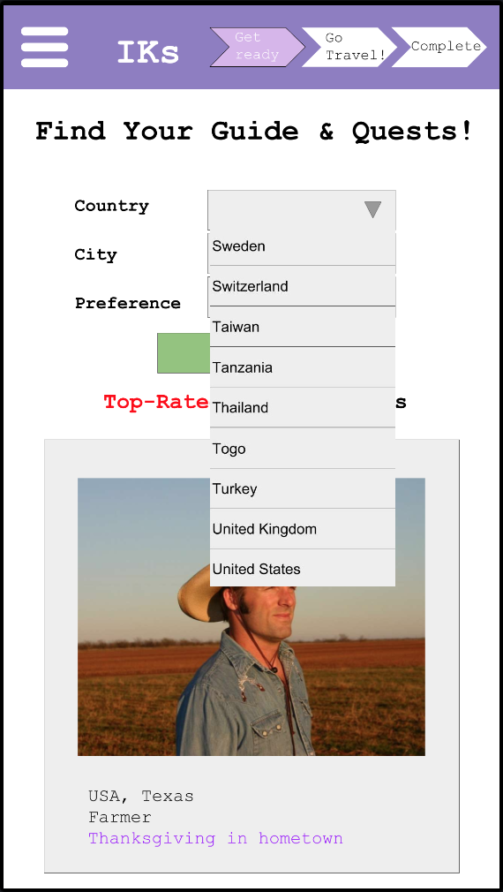
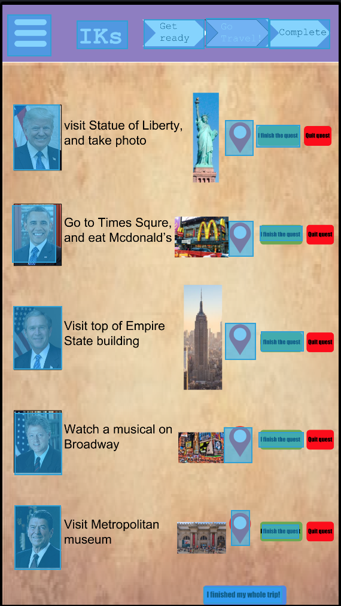
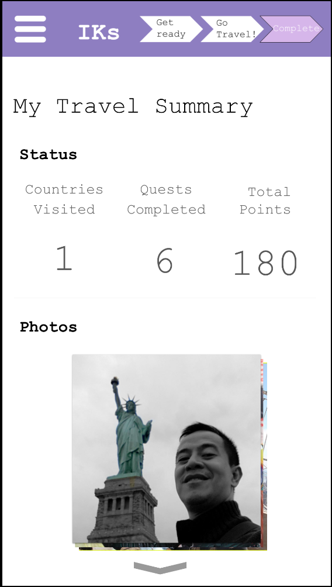
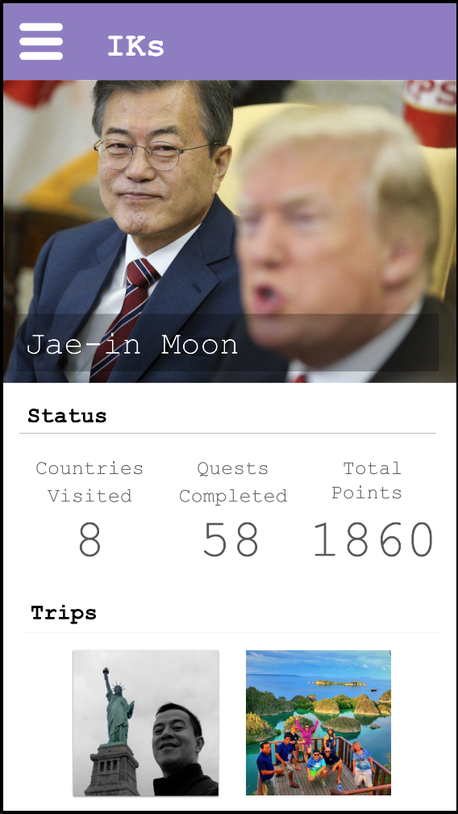
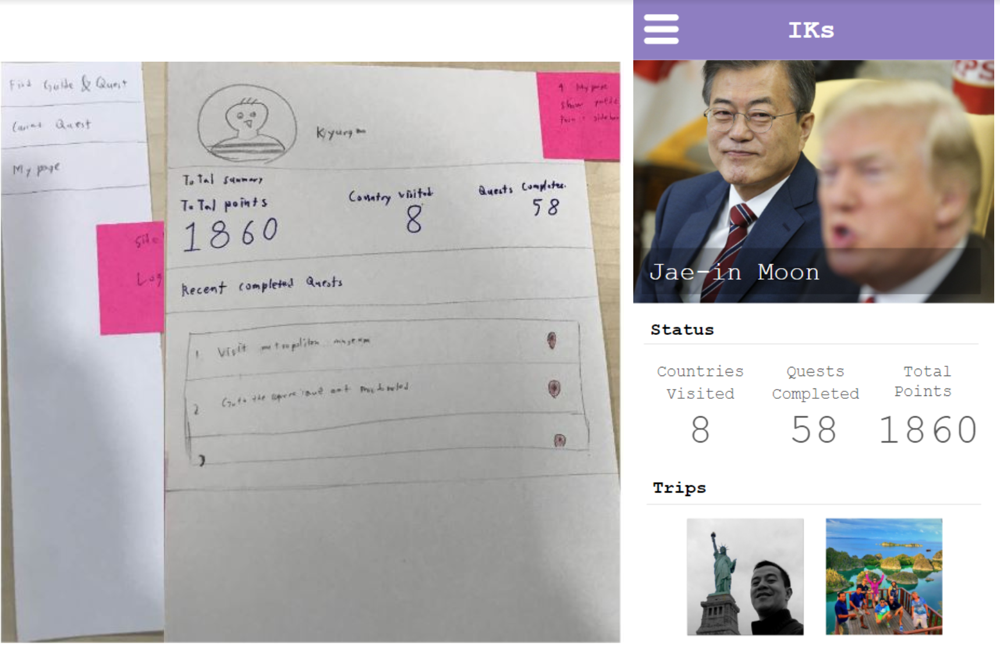
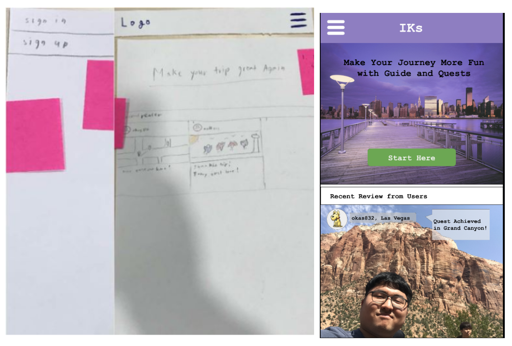
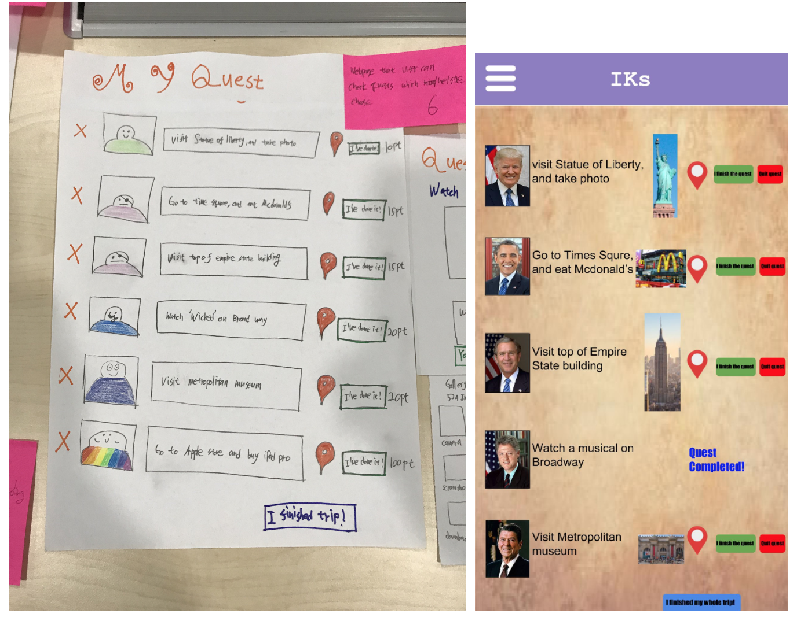
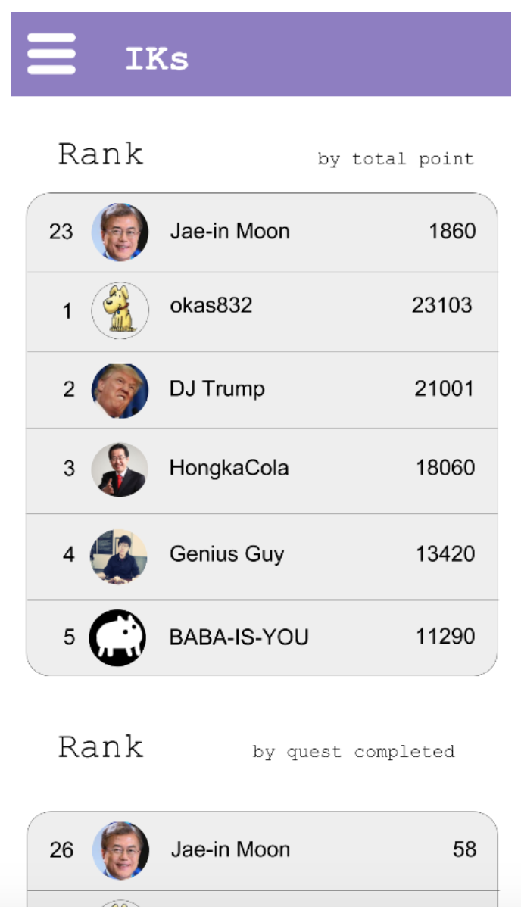

# DP4 Report
* Team name : IKs
* Team member : Kyungmo Kim, Hajun Kim, Minyeop Choi, Yoseph Kurnia Soenggoro

## POV
Travelers need to get memorable, niche and immersive experiences from traveling, rather than just visiting a certain area and do something which is trivial(e.g. Sightseeing, enjoy the meal) because frequent travelers often feel sick with the same pattern.

## Task1.
1. Plan travel with suggested quests.
   * "I want to go on a travel with fun quests!"
2. Make memories during the journey with chosen quests.
   * "After the long journey, I finally completed quests! How can I complete"
3. Look up your past track of the trip.
   * "I want to see all the progress made so far. Good days..."

## Prototype
* Link : https://invis.io/KXREZK65EYT

### Prototyping tool - InVision
* Worked Well
  1. Users can provide basic functionalities for websites like button clicks or link to another page.
  2. Possible for multiple users working on the same prototype at the same time.
  3. 'Screen as overlay' function helped to show small pop ups.
* Not Worked
  1. Invision does not provide merging two web pages so that we can scroll down smoothly.
  2. Invision does not provide textbox feature, where the user can type input into the prototype.
  3. Invision does not provide adding functionality on ‘screen as overlay’. The only function that I can do on overlay was just closing it. Therefore, we cannot implement more complicated logic when we show overlay on the previous screen.
  4. Invision does not support to change specific part of the layout. Therefore, if we wanted to make same page with different image, we needed to make every screen for each pages.
  5. Component based prototyping was impossible. We couldn’t put two images in the same page.
  6. We cannot add visually aesthetic and smooth animations or transitions between pages or components in the web page.

### Design Choices
1. Did not implement ‘uploading photo’ when user clicked ‘upload photo’. Because uploading photo was part of overlay image, we couldn’t add more function.
2. Did not implement a real-time map because Invision are unable to support map in the prototype
3. Did not make fully functional quest and guide search page because it was impossible to make ‘real search’ and we considered it too laborious to implement all sub-pop ups for all guides.
4. Did not implement the star rating functionality in the prototype because Invision does not provide such advanced feature to highlight the stars for the rating system.

### Representative Screenshots
1. Find your guide & quests

Find Your Guide & Quests page adds panels for each local experts and has autocomplete searching functionalities (unfortunately, we could just make a simplified version of it).

2. My quest page

My quest page shows quests that user chose, and user can check specific information about the quest, and upload photo when they complete their quests.
When they completed the whole trip, user can go to 'my travel summary' by clicking the button on the bottom.

3. My travel summary

The 'My Travel Summary' page gives a short summary about the journey done, including information such as countries visited, quests completed, and the total number of points gained throughout the journey. Moreover, photos that has been uploaded through the quests can be revisited again.

4. Mypage

User can check total number of quests and scores earned on previous trip.
Also, they can cherish their memory of the trips by clicking images on 'rips' side.

### Instructions
* Four main tasks you can do
  1. First, find your guide & quests and register quests you want to complete.
  2. If you complete the quest, you can uploaded the photo (for proof) on my quest page.
  3. If you finish your trip, then you can check the summary of your trip.
  4. Lastly, check the summary of previous trips in my page.
* You can navigate the entire web site with using our menu bar. Feel free to use it.
* If you want to check current progress, look at the progress bar at the top of the screen.

## Observation
1. Plan travel with suggested quests.
   1. User clicked the arrow mark on the menu bar, and they are moved from 'Find your guide & quests' webpage to 'my travel summary' page. 
      * Refer : P1, P3
      * Criticality : HIGH
      * Solution : Having the progress bar with functionalities seems not very useful and to some extent a very strange feature (e.g. The user just start preparing the journey, but already able to skip to the 'Complete' section). Therefore, we will change its functionality to only show their current status, not changing their current status.
   2. User wanted to see ‘Recent Review from Users’ in a main page, but it did not show anything. 
      * Refer : P1
      * Criticality : Low
      * Solution : This was because of lack of implementation. Showing summaries of recent users would be enough.
   3. User did not notice the progress bar on the top. Because of that, user keep confused about their current status.
      * Refer : P2
      * Criticality : Medium
      * Solution : Add simple tutorial on ’Find your guide & Quests’ page when user first moved to this page. Adding smooth animation for transition in progress bar would also be great in terms of notification. 

   4. Users tend to slide from the left side instead of pressing the triple-lined button at the top.
      * Refer : P2
      * Criticality : Low
      * Solution : Providing such functionality in the next design project is an answer but we consider this to have low priority because most of the web sites are great even without it.
   5. For the panels in “Find Your Guide & Quests” page, it would be better to add titles for each. Users couldn’t recognize what it was.
      * Refer : P3
      * Criticality : Medium
      * Solution : Add interesting titles for each panel. Users must acknowledge what kind of experiences they will have.
2. Make memories during the journey with chosen quests.
   1. The user was confused what to click in the ‘Find Your Guide & Quests’ after selecting the guides and quests as there are no buttons to go to the next stage of the process/next page.
      * Refer : P1, P2
      * Criticality : High
      * Solution : There seems to be a lack of affordance in the ‘Find Your Guide & Quests’ page. One possible solution to solve such problem is to provide more visible buttons on the bottom of the page that is able to guide the user to go to the next page, which is ‘My Quests’ page.
   2. User clicked pictures of venue on ‘my quest’ webpage, but it did not give any response.
      * Refer : P2
      * Criticality : Low
      * Solution : Showing other’s completion about the quest from clicking the pictures in the venue would be a great solution. It would help users to get clear image about what users should do for the quest.
   3. User was confused after clicking ‘I finish the quest’ button, because two buttons ‘upload photo’ and ‘write a diary’ did not work.
      * Refer : P1, P2, P3
      * Criticality : Medium
      * Solution : We cannot implement this part because of invision limitation. In actual implementation stage, we can implement pop up page for uploading photo and writing a diary.
   4. Users could not find ‘I finished my whole trip’ button, and did not understand the functionality of this button.
      * Refer : P1, P2, P3
      * Criticality : High
      * Solution : Give a tutorial when user first go to my quest page in order to let user know the each functionality of the button.
   5. User complained that size of the letters in “My Quests” page was too small for smartphone applications. It was hardly legible.
       * Refer : P2
       * Criticality : High
       * Solution : In actual implementation, we can increase the size of the buttons, and reduce number of quests in one page.
3. Look up your past track of the trip.
   1. The travel diaries that the users have written after uploading their photos upon completing each quests are not shown in the travel summary.
       * Refer : P1, P3
       * Criticality : Low
       * Solution : Show the travel diaries that the users have written when they uploaded their photos, similar to how Facebook display their user’s photo albums. 
   2. User wanted to share their memories with others.
       * Refer : P2, P3
       * Criticality : Medium
       * Solution : As we can see others “My Travel Summary” from the first page, we must provide some ways for users to interact with other users. We think adding comment or like functionalities would be the start of it. 

## Paper vs Digital
1. types of usability issues they helped identify
   * Paper : Users helped to find the most critical and general issues, such as  missing linkage between the webpages. 
   * Digital : Helps to identify whether if the entire process the users are making is efficient or not. We could not measure exact time for doing tasks so it was hard know whether if our website was efficient enough by paper prototyping. We could also think about the actual size of the contents of our website considering the actual ratio between screen width and height. It determines the overall layout and feelings of our website.
2. Participants' reaction and expectation to prototypes
   * Paper: Users did not expect much about aesthetic design in the paper prototype. Therefore, they gave more feedbacks about functionality, rather than visuals (color, size of the buttons)
   * Digital: Users expected more functionalities than paper prototype, such as typing a words, and actual pop ups.
3. Changes from paper prototype to digital prototype
   1. Mypage renewal
      * 
      * Usability issue : Hard to find the previous travels in mypage 
      * Feedback from Paper prototype : Wanted to see the photos taken and the travel summaries from their previous travel in the “ My page” instead of the lists of quests that they have completed.
      * Solution and changes : Changed the contents of the profile from listing quests to checking their trip summary 
   2. Main page renewal 
      * 
      * Usability issue : Cannot find the way to go other page, hard to know the menu bar is exist 
      * Feedback from Paper prototype : Couldn’t remember the difference between sign in and sign up and couldn’t find the way how he can view the sidebar.
      * Solution and changes : Add ‘start here’ button, so user do not have to click menu bar to sign in
   3. Quest page renewal
      * 
      * Usability issue : Cannot understand the buttons function because of wrong design
      * Feedback from Paper prototype
        1. Didn’t know the functionality of “I’ve done it” button In “My Quest” page because it was already colored green
        2. Felt that cross buttons in front of listed quests in “My Quest” page were confusing in terms of its functionality. He confused it with the concept of completion.
        3. Could not understand the quest description
      * Solution and changes : change ‘I’ve done it’ to ‘I finish the quest, change cross button to ‘quit quest’, add simple image for the quest.
   4. Ranking system
      * 
      * Usability issue : None
      * Feedback from DP4 studio : we need to add more gamification feature.
      * Solution and changes : we added one more page, which is ranking system.
      
## Studio Reflections
1. Add progress bar on menu bar
   * We added arrow shaped progress bar, so that user can know their current status.
2. More gamification feature is needed (e.g. ranking)
   * We currently added ranking system on current paper prototype. We will add more gamification functions on further design project.
3. Fine and aligned layout structure is needed
   * We worked individually for each page so we agree that this is an issue. We are going to incorporate in some ways for the next DP.
4. For next DP, you can omit sign up and sign in features
   * Since it is relatively unnecessary to the main function of the page, Sign Up and Sign In features will be omitted for future DPs. However, in the real implementation, it will still be included.
5. How are you going to deal with quest farming problem in gamification stage?
   * There might be various solutions for this one.
   * If the user uploaded a photo for submission, then the website will notify the user that they will not be able to submit more photos for verification (supposing there is someone to verify the photo). In case the photo is verified to be true, then no more photos are allowed to be submitted. Otherwise, the user will be allowed to upload other photos.
   * Use openCV to check the similarities between the photos uploaded by the user. If we find that same pictures are used for completing several quest, we can give a penalty to that user.

