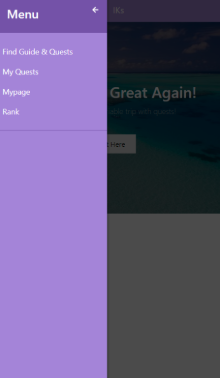
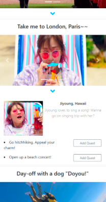
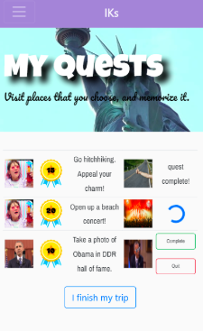
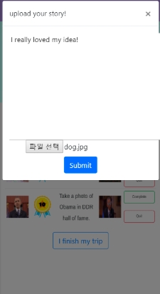
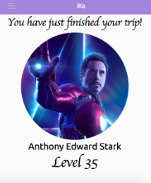
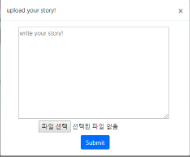
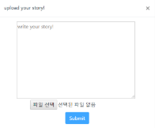
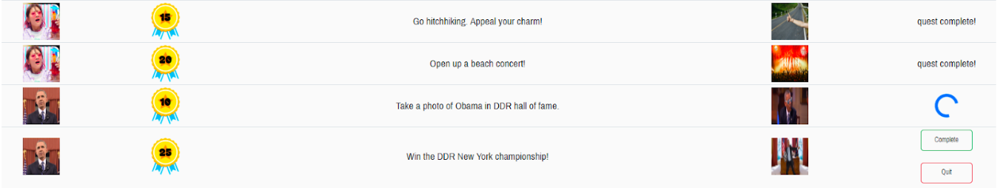
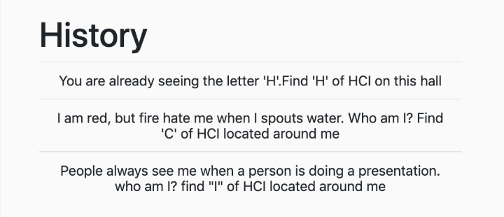

# DP 8 Report

#### Final Interface
1. Representative Screenshots
- Menu bar: Specialized UI component for mobile website. We designed it considering proper size, shape and color. We can navigate through all the primary pages in our website. 

- Find Guide and Quest page: Bootstrap Accordion and Carousel UI component worked well for this page. Users can easily skim through all the photos the guides provide and guess about what the users would do for the quests. 

- My quest page : User can take a photo and upload it to prove that they completed their individual quest. In addition to this, user can write simple diary about their feelings while completing the quest. 

- Travel Summary: Provide the users a complete information of all their quests and achievements gained from their trip.

2. Quality Arguments

Menu bar
Navigation is a highly essential element to have within a website and without it, the users will have trouble in searching or achieving their objectives. In our website, we implement such feature on the menu bar. The menu bar is the central feature of our website because it provides the users a hub to navigate within our website in easy and simple manner. Since the menu bar exists within every pages in our website, it provides the user flexibility to ‘move’ freely from pages to pages. This is important because during the trip, the users might discard some of their initially chosen quests and might want to add additional quests as replacements. By using the menu bar, the possibility exists.

Bootstrap Carousel & Accordion in Find Your Guide & Quest page:
Adopted Carousel for showing multiple images without minifying images. Users can immediately have abstract concept of what the users would do for the quest by looking at images one by one. 
Used Accordion to hide details about quests that the guide provides. Organizing contents first by guides and next by quests allows users to find interesting guides really fast and efficiently. 

Buttons with high information scent in my quest page:
User have freedom to complete, or quit their quests. The users do not have to struggle with finding buttons to accomplish their desire, because every buttons on this page have color with green(safe), blue(safe), and red(danger). Also, we shows pop up to ask the users again.

Giving a feedback when user upload the photo in my quest page:
In first implementation, we did not add any visual feedback when the users upload their photo. After we got several feedbacks from user, we shows spinner when uploading process is executing. It helps the users to feel less confusion.  

#### Iteration
- We got lots of feedbacks from the last design project but we were running out of time because of the finals. Our team met two times before the final demo session and discussed about who will improve what and how to present our demo. We decided to focus on addressing some high priority issues we discussed in DP7. 
-  Disable button when user did not upload the photo

Before

After

- “Add Quest” Button in “Find Your Guide & Quest” page was not working properly. It sometimes did not appear and presented some inconsistency with the database. We fixed the issue.

- Add the history on mypage to look the past quest that user completed.

#### Individual Reflection
1. Yoseph Kurnia Soenggoro

My main contribution to the project is designing and implementing the travel summary page, that provides the complete information of the user's trip. For the group discussion, I think our members provide a lot of fresh and quality ideas into every discussion and we always learn a lot from each other and other people during each step of the designing process (from DP1 to DP8). Despite all the positive aspects, there are also some common negative aspects, especially difficulties in finding common times of meeting. This is because every one of us are busy with our own schedule, yet the course demands a lot of collaboration within our project, from doing interviews, writing reports, to implementing codes, there tend to be some problems in collaborating physically. Nevertheless, we managed to resolve it by doing one-to-two-hours-meeting once or twice a week and layout the divison of work among members. Then, the rest of the work was done individually online. In this context, the meeting played a crucial role in building consistent ideas within our group members and has helped us in progressing our project smoothly. Despite the short duration of weekly meetings, we still managed to come out with unique and original ideas which were used within the project. These deep insights are usually gained through either creating a creative environment, by generating various ideas within limited amount of time, or interviews with some participants that spent some time in trying out our prototype. As a result, it has given us a great result and product in the end, which many people enjoys during the project showcase. Nevertheless, more improvements in the future are needed in order to increase the value of the website if it is going to be used for business purpose. Overall, I am very satisfied with our group work and the experience are valuable and have contributed a lot within my personal development.

2. Kyungmo Kim

*What worked well and not in your team? How did you overcome any hurdle in teamwork? What lesson about teamwork did you learn that you might apply to your next team project?*
 
What worked well was each team member accomplished well with their own part. Because our web page has consecutive structure (finding quest -> complete quest -> check the result), free rider in the team could ruin everything.
Thankfully, Every team member faithfully participated the regular meeting twice a week, and enthusiastically shared their idea, and implemented their own part.
 
The problem of teamwork is that separation of the work makes the difficulty on iteration part, because we did not exactly know how does other colleagues’ web page works.  For example, when I find some defect or some part that can be improved on colleagues’ part, I could not solve this issue by myself, but told my colleague ‘I think it would be better if you fix this part.’ As a sequence, it required more communications between team members, and time. However, I felt that meeting twice a week was not enough for solving this problem, because improvement  is a difficult process, but also miscommunication between team member caused the result of improvement was different with my initial intent.
Therefore, we learned that the most important part of teamwork is to discuss and share about ideas more often in order to close the gap between ‘my suggestion’ and ‘ colleagues’ actual implementation’. This would make more satisfying and high - quality result.  
 
Through the team-based design project experience, what did you learn about the user-centered design process and web-based GUI implementation?
 
The most impressive experience while conducting user experiments was that what we thought user-centered was NOT user-centered. I initially thought that ‘Enjoying the trip while complete quests’ was easy concept to understand, and plain for everyone. However, when we tested low-fi prototype, I was a little bit disappointed because user seemed too confused than what I expected. At that time, I realized that I became too tolerant about concept of user-centered design.
I reckon the reason why this happened was because the unfamiliarity of web-based GUI implementation makes our goal toward ‘barely functionally working web page’, not ‘user-centered web page.’
Therefore, the most valuable lesson from this is that foundation of user-centered web page is the implementation skill. If we afford to think about usability issues while implementation process, then it will lead to a better user-centered web page design.
 
Another lesson is from user-centered design process is that making prototype helped to decide the direction of implementation, but it sometimes hinders the flexibility of implementation.
While making our web page, I also made personal web page, which shows box office result of movies (you can check this web page on
http://ssal.sparcs.org:33219/). I also made low – fi prototype when I made this web page, but I changed lots of features from prototype because I found better layouts whenever searching about the design. Thanks to not following prototype, I felt less burden about changing the layout, and I can save more time. 
However, the reason why I feel that not making low – fi prototype can be good is just because I made my personal web page just for fun, and also did not conduct user experiment iteration. Therefore, I have to build up my experiences on making an web page, to think about this issues more deeply. 
 
At any rate, The most important lesson that I learned is that users are always right. Reason for making simple prototype is for saving times in order to conduct more user testing, and reason for doing iterations is because user hate previous design. I will always think about this lesson. Making an web page is just a skin deep. What makes web page valuable is users, and This is the reason why we learned HCI.

3. Hajun Kim

Thank you for our professor and TAs for preparing this exciting course. For all design projects, we decided to “divide and conquer” except for some parts that needed discussions. 

4. Minyep Choi

