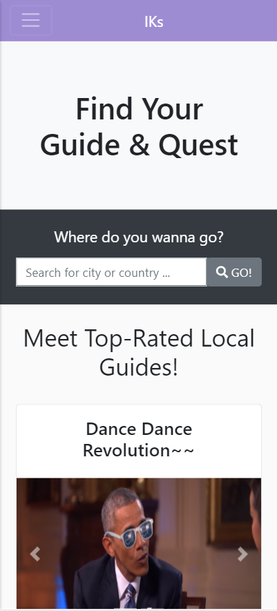
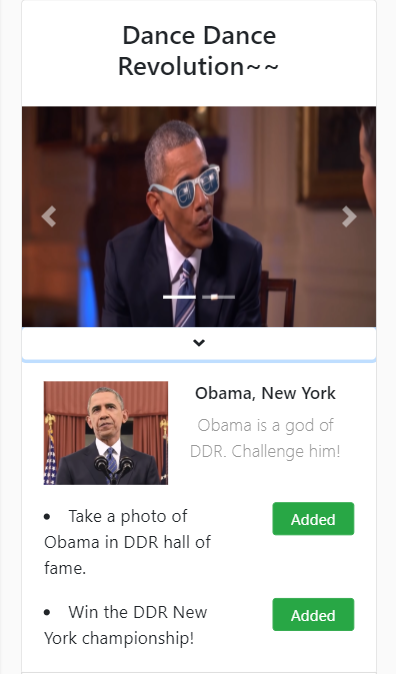
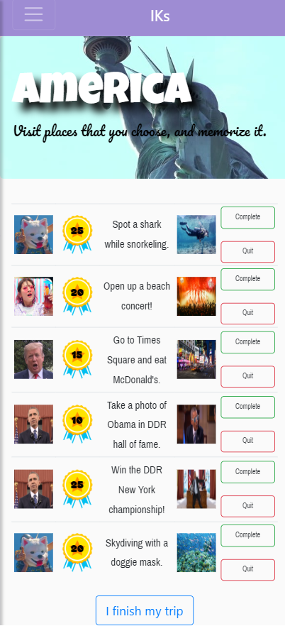
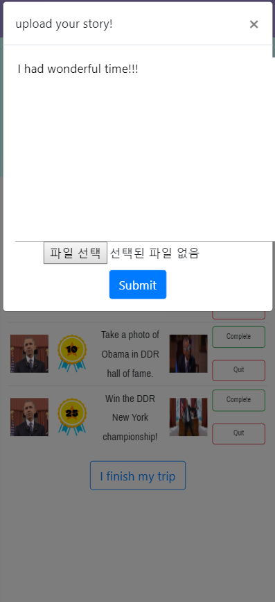
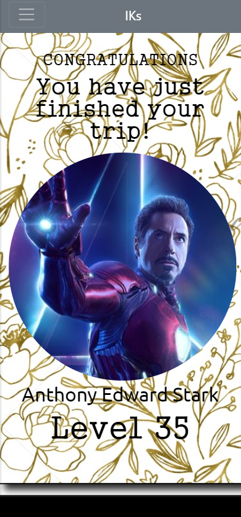
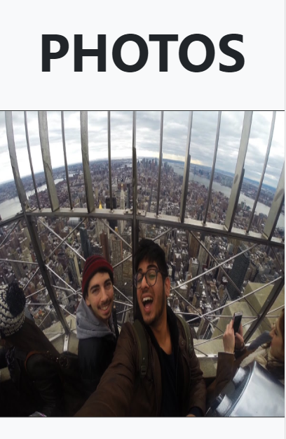
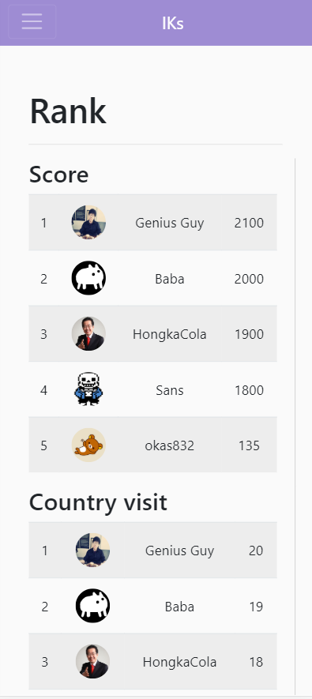
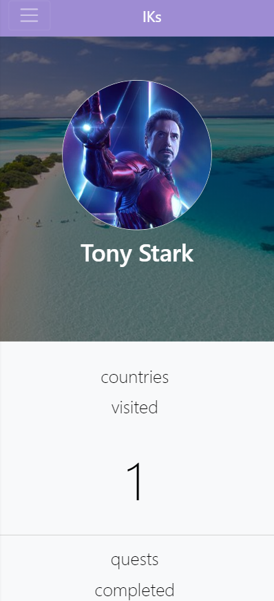

# DP6 Report
* Team name : IKs
* Team member : Kyungmo Kim, Hajun Kim, Minyeop Choi, Yoseph Kurnia Soenggoro

## POV
Travelers who need to get memorable, niche and immersive experiences from traveling, rather than just visiting a certain area and do something which is trivial(e.g. Sightseeing, enjoy the meal) because frequent travelers often feel sick with the same pattern.

## Task
*  Plan travel with suggested quests.
   * "I want to go on a travel with fun quests!"

*  Make memories during the journey with chosen quests.

   * "After the long journey, I finally completed quests! How can I complete?"

*  Look up your past track of the trip.
   * "I want to see all the progress made so far. Good days..."
*  Earn points on the trip, and compare with others.
   * "I want to gather more points to compete my friend!"

## Implementation Note
* Webpage URL : https://cs374-iks.github.io/
* Repository URL : https://github.com/cs374-iks/cs374-iks.github.io
* Libraries and Frameworks: 

  * Bootstrap
  * Firebase 
  * Jquery 
  * Google fonts
* Representative Screen shots
  * Main page

    

    This is main page of our website. User can start by clicking 'start here'

  * Find Guide and Quest page

    

    User can find their quests provided by guides.

    

    When the user click the image of the guide, the user can select quests provided by this guide.

    This page is related task 1, which is 'Plan travel with suggested quests'.

    

  * My Quest page

    

    User can check quests added on previous page. 

    

    

    When the users complete their quest, they can submit image of completion with simple diary. 

    This page is related task 2, which is 'Make memories during the journey with chosen quests.'

  * Travel Summary page

    

    When the users click 'I finish my trip' button on previous page, it shows the tracks of this trip. 

    

    Photos and diaries uploaded by the users on the previous page can be seen here. 

    This page is related to task 3, which is 'Look up your past track of the trip'

    

  * Ranking page

    

    Users can compare their stats with others in ranking page. 

    This page is related to task 4, which is 'Earn points on the trip, and compare with others'

​    

  * My page

    

    Users can check how many quests are cleared, and points are earned on my page. 

    This page is related to task 3, which is 'Look up your past track of the trip'

## Individual Reflection

##### Yoseph Kurnia Soenggoro

* Which part of the UI did you directly contribute to?

   * I contribute to designing and implementing the travel summary page and partially on designing the data structure used in the database

* What were some of the difficulties you faced?

   * I think designing the layout, choosing the right colors (background, text color, icons), and choosing the fonts that represents something fun for the travel summary page that is aesthetically pleasing to look is very difficult. Moreover, choosing the informations need to be displayed such that it provide simplicity to the user requires a lot of consideration needs to be taken.

   * One of the idea for our website is to implement some gamification and I think animation plays a huge role in providing the use the ‘game’ feeling. Not only choosing what to implement is difficult, but implementing them in code is a challenge itself. I took a lot of time in searching for codes that give certain features (e.g. star ratings, game experience bar, etc) as they are taught in lectures or tutorials.

* List one useful implementation skill you learned while working on DP5 and DP6.

   * From both DP5 and DP6, I learnt how to use div and Bootstrap layout effectively to make the layout for the travel summary page such that it looks nice and tidy.

   * I also learn how to work and communicate effectively with group members within a group programming projects. Moreover, I learn how to use gitHub to build websites that results from our group projects for the last two weeks.

##### Minyeop Choi	

*  Which part of the UI did you directly contribute to?

   * Contributed main page, mypage, and Rank page

   * Made a template of the pages for topbar and sidebar 

* What were some of the difficulties you faced?

   * I tried to cover all devices, PC and mobile, with responsible web design. But it was hard to control the thresholds and aligns of each size of the devices.

   * Since database scheme is more important to other than me(because of not using the whole data), when the scheme is change I have to change the code according to the changes. But it is kinda annoying thing.

* List one useful implementation skill you learned while working on DP5 and DP6.

   * While making the template, I think the structure of the webpage and implement the page that can be used to all pages. I learned how to make a structured code for other to use.

     

##### Hajun Kim

* Which part of the UI did you directly contribute to?

   * We decided to separate our work with a page as a unit. I made “Find Your Guide & Quest” page. 

* What were some of the difficulties you faced?

   * In terms of UI, it was hard to make a clean layout to give simplified view for users. I tried providing all information about guides and quests by listing at first, but it was literally too much information. Therefore, I decided to use Bootstrap accordion to come up with this. Most of the difficulties related to programming come up because of the lack of knowledge about the things that are running behind the scene. I didn’t know how to iterate through the data read from the database at first. I couldn’t handle “Add Quest” button click event properly because of the lack of knowledge about how Javascript anonymous function behaves. It was also hard to communicate with our teammates because database scheme always changed as we progressed, so we had to meet more than we expected. 

* List one useful implementation skill you learned while working on DP5 and DP6.

   * Embedding dynamic HTML structure using Javascript. I didn’t know formatted string would be this convenient. I could easily add HTML structure created as search results by using formatted string feature. 

     

##### Kyungmo Kim

* Which part of the UI did you directly contribute to?

   * I contributed on ‘My Quest’ tab on the webpage. 

* What were some of the difficulties you faced?

   * The most difficult part was database unification part. ‘My Quest’ tab shows quest added from ‘Find Guide & Quest’ tab, which is implemented by Hajun Kim. Therefore, we need to discuss what data scheme do we need , and need to let other person know if database scheme should be fixed. 

   * I begun to implement dynamic part like retrieving data from firebase, or fill in the table using retrieved data before finishing my design. Therefore, it makes lots of difficulties on changing overall design, even if I came up with a  better design. 

* List one useful implementation skill you learned while working on DP5 and DP6.

   * I learned what kind of difficulties we stumble upon while communicating with others. Implementation of DP5 and DP6  was not very difficult compare to PR3. However, we need to keep discussing about data scheme or webpage transition with collegue.  I cannot change my data even if the modifications are needed, and explain the meanings of variables on the database. 

     

## Studio Reflection

* I wish the number of points was more legible

	* We will change the style for text so that point texts are more legible.

* I wish ‘find guide and quest’ page is more understandable. Where is guide and what they are for?

	* In this webpage, ‘guide’ stands for ‘quest provider’. Basically guide does not accompany the trip. It will be better to add tutorials for each pages, so that user does not confused with the terminologies. We will also emphasize the word “Guide” and “Quest” to easily recognize which is which. 

* Do Photos show all photos during the trip or merely show submitted or uploaded photos?

	* All photos, shown in travel summary pages, are uploaded when user click ‘complete quest’ button on myQuest page.  
