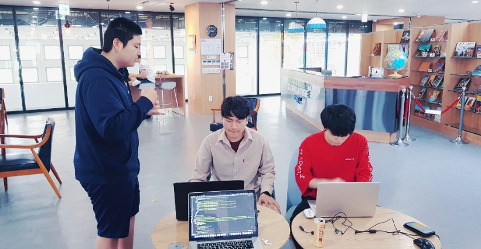
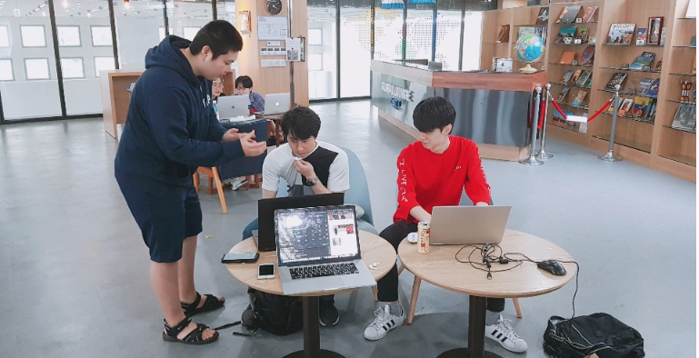

# DP7 Report

* Team name : IKs
* Team member : Kyungmo Kim, Hajun Kim, Minyeop Choi, Yoseph Kurnia Soenggoro

## Written Protocol

####  Instruction for preparation

1. Prepare Smartphone Device: Any smartphone with any operating system attached which is capable of running the most recent version of Chrome browser.

2. Install Web Browser: Latest version of Google Chrome only.

3. Provide Images: Download images which are used to clear quests. Images for every quest must be provided to make sure the user can clear any quest.  

4. Clear Database: Turn on the browser and click the link below.

   <https://console.firebase.google.com/project/fir-test-ded6e/database/fir-test-ded6e/data>

   Remove all entries below “Quests” tab in order to remove all records made from the previous testing. 

5. Find Proper Participant: Frequent traveler, which is our main target user. Prepare a questionnaire to check whether the user is an appropriate target user.

6. Setup Environment: Provide comforting environment where users can try the service freely, without having a feeling being judged. 

7. Before proceeding to the user testing, provide the participants with brief description about the website and the context when using the website

8. Begin Test: Turn on the browser and click the link below. 

   https://cs374-iks.github.io/

   If you can see “Make Travel Great Again!” sign, you are ready to go.

#### Introduction and informed consent

Thank you for participating in our experiment! In this experiment, our group will be recording all the information in the forms of photos and written documents. The written documents will include all the important information that can help our group in analyzing the result and gain a better picture on the quality of our UI design. Do you agree with recording your personal data?

#### Tutorial or training

If a tutorial session is given to the participants, it will show everything the participants need to know about our website usability. In order to observe the advantages and disadvantages of our website’s UI, our group decided to intentionally omitting the tutorial/training session from the experimental design.

#### Task list & instruction

Don’t you think that the traveling currently boring? We come up with a solution for this by providing some interesting quests to clear along with your trip. 

Our service is for helping to plan the user who feels bored about the trip. On this website, you can find quests and follow clues to complete them. If you complete the quests, points will be rewarded, and you can compare this point with others!

There are three things you can do. Since our tasks are designed to be sequential, we will provide one by one. 

So why don’t we start? The first task is, “Choose quests you want to clear. Plan the travel with suggested quest in the place where you want to travel. “

< Participant finishes first task>

Great job! 

< Give some cookies to the participant >

The second task is, “To prove that you complete the quest, please upload your photo and write a simple diary”.  

< Participant finishes second task>

Incredible!

The last task is, “After the trip ends, check photos and diaries that you have uploaded”.

#### Recording strategy

Record the observation with photos and written documents, and voice recording 

Photos: to capture the interesting moments and proof of actual testing  

Written document: to record detailed issues while conducting user testing. Furthermore, record detailed timeline while testing(e.g. How much time user spends on the page or tasks,)

Voice recording: to reassert usability issues and user opinions.

#### Questionaries, Interview questions

1. There are total six pages on our website, which are ‘main page’ , ‘find guides and quest page’,’travel result summary page’, ‘ mypage’ , ‘rank page’ . Is there some pages that you feel confused about its functionality when you look at it first? 
2. If you feel confused about a specific page, what makes you feel confused? (Text on the buttons were not clear, components does not act as I expected, there are too many buttons on the web page, color scheme does not match...)
3. Among these six pages, what feature or function do you think will be good if applied to the other pages?
4. (Ask user to use “My Real Trip” website for 2~3 minutes, including explanations about what “My Real Trip” website is about.) Comparing to “My Real Trip” website, which contents are better, or worse? Please feel free to talk about everything you felt by comparing our website and “My Real Trip”. 

#### Debrief prompts

This is the end of our user testing. 

Your advices will be very helpful for the further development of the web page. 

Thank you for investing your valuable time on participating in our user testing section. 

## Session observation
#### Participants 

* Participant 1

  

  Korean, 24 years old, KAIST undergraduate student, Hajun Kim brought him over.

  He is a representative target user, because he travels twice a year, and has lots of experiences using travel-support applications. 

  Showed interests about our website, by mentioning his travel to Zurich in Switzerland where the government is supporting travel gamification. 

  

  summary -  We found lots of technical issues from this session. The participant gave lots of feedback about the system of the service itself. 

  

* Participant 2

  

  Japanese, 24 years old, exchange student whose major is business management. Kyungmo Kim brought him over.

  He is a representative target user, because he travels twice a year, and likes traveling the interior of the country(Japan) with his girlfriend. 

  He never traveled alone, so he is not used to plan by himself. 

  

  summary- The participant kindly asked a lot about each pages role and functions. He suggested a lot about usability issues considering usability dimensions. 

  

* Participant 3

  (There are no pictures of him, because he refused to take a photo, or record his voice)

  

  Korean, 22 years old, KAIST undergraduate student

  He is a representative target user, because he travels twice a year, and always uses travel assistant when traveling

  

  summary- The participant suggests some design problem like arrangement of object in the website. He talked about some improvement by comparing to other websites.

  

## Usability lessons

#### Usability issues
###### Theme 1 recognition problem 

*Recognition problem refers to the usability issues which are already implemented, but the users could not recognize it.* 

- In ‘Find Your Guide & Quest Page’, he cannot search desired result because there are no suggestions, autocomplete functions. And several words that have the same meaning such as ‘USA’ and ‘America’ did not show the same results

  - P1
  - middle
  - solution : Add autocomplete on search function so that users can find desired place more easily. 

- In ‘Find Your Guide & Quest Page’, He couldn’t find how to move to ‘my quests page’

  - P2
  - high
  - solution: Add button on the bottom of this page, which moves the current page to ‘my quest page’

- In ‘My quest page’, he didn’t know that picture is needed for submission.

  - P2
  - high
  - solution: Disable the submission button before user complete uploading the photo and diary.

- In ‘Find Your Guide & Quest Page’, he did not realize that down-arrow button, which shows quests provided by the guide, on guide page. 

  - P1
  - high
  - solution: add ‘click here to open quest’ text on the down-arrow button, so that make the users recognize it .

- In ‘My quest page’. He felt confusion when every quest was deleted after clicking ‘finish my trip’ button.  

  - P1 
  - low
  - solution: deleting every quest was intended function. Therefore, we will keep this functionality. 

- In ‘My quest page’, he could not notice clicking the image of the place shows Google map which indicates place to go. 

  - P2, P3
  - Middle
  - solution: add common icon for google map, so that help user to notice google map functionality. 

###### Theme 2 technical problem

*Technical problems refer to usability issues whose functions did not work properly, because of implementation errors.*

- In ‘Find Your Guide & Quest’ page, no add quest button popped out after searching.

  - P1
  - High
  - Implementation error. Change programming code which makes this error.

- In ‘My quest’ page, Same picture appeared at the second upload.

  - P1, P2
  - High
  - Implementation error. Change programming code which makes this error.

- In ‘Travel Result’ page, Point calculation and number of quests completed not mentioned.

  - P1
  - High
  - Implementation error. Change programming code which makes this error.

- In ‘My quest’ page, Google maps locating system didn’t work.

  - P1
  - High
  - Some places won’t work if the Google maps cannot find the place with keyword. Fix the keyword or using the Latitude longitude can fix this.

- In ‘Travel Result’ page, Bad alignment on uploaded images.

  - P2
  - Middle
  - Design Issue, we will fix the alignment.

- In ‘My quest’ page, There is always America on the banner on my quests page.

  - P1, P3
  - Middle
  - This is static because the quests are only in America. Fix to mypage instead of the country will cover the whole cases. 

- In ‘Travel Result’ page, cannot rate the travel.

  - P3
  - High
  - Implementation error. We will add Javascript code deals with rating system. 

###### Theme 3 lack of contents 

*lack of contents refer to the functionality which will be better if added, suggested by the users.*

- Confused by looking at Tony Stark profile image in ‘Quest Complete Page’ and ‘My Page’ because he didn’t fill in the account information by himself. 

  - P1
  - Low
  - solution: There is no indication on profile page helps the user to recognize it is their own profile page. Add some texts to make user to recognize.  

- Tried to revise diary(text) in ‘My Page’ history section but didn’t work.

  - P2
  - Low
  - solution: Add a button which makes it possible to change diary after submission.

- It would be better to view video instead of images in ‘Find Your Guide & Quests’ carousel. 

  - P1
  - Low
  - solution: This has come up because the user said that it would be hard to get the context of what the user should do for quests. Just adding gif animation on ‘Find your Guide & Quests’ carousel can be the solution. 

- It would be better to sort guides based on user rating on ‘Find Your Guide & Quests’ page.

  - P1
  - Low
  - solution: We did not implement ratings to guide, which was actually our first intention. Sadly, we can’t support this functionality because we don’t support user evaluation of guide activities and quest qualities. 

- Social service seems to be a prerequisite for our service. The user might lose interest unless there are reasonable amount of prizes or social communications.

  - P1
  - Low
  - solution: Not only the rank page showing the user’s position, it can also show the popular quests or add friends feature to compete with friends.

- Need to show the path to the destination inside ‘My Quests’ google maps. Also showing related dining service, hotel and other services are necessary because the user might want to go other places while traveling. 

  - P1
  - Low
  - Use the google maps’ built-in functionalities that find the path from the current location.

- Highlighted theme for my status in ‘Rank’ page is needed. Also need to show my ranking based on score, country visited and quests completed.

  - P1, P3
  - Middle
  - Fix the rank page to show highest rated person, and show user’s rank on below side of the table.

- Need to support information about weather, safety, flight information and things that are necessary in order to clear quests in ‘Find Your Guide & Quests’ page.

  - P1
  - Low
  - It is possible to provide weather, safety and flight information by getting information using various APIs but it can be done later on the process.

- Want to see some signals that the menu bar exists at the top. Wants some navigation. 

  - P2
  - Middle
  - Give simple system message or box saying “Quest added. You can check your quests in ‘MyQuest’ page. Click the menu bar at the top.” 

- How about integrating ‘My Quests’ page and ‘Mypage’? It is confusing because there are two separate information. 

  - P2
  - Middle
  - ‘My quest’ only shows the current quests that the user added. However, ‘Mypage’ shows every quest and previous trip information. Therefore, combining two of them will make more confusion.
  - It will be better change the text ‘myquest’ to ‘current quest’, so that quests on the ‘My quests page’ are temporary. ‘

- Main page has nothing. Want to see something on main page.

  - P3
  - Middle
  - Add some others’ reviews in popular quests.

#### High-level reflections

1. We found too many technical defects while conducting user experiments. While feeling ashamed, It would be much better if we show more polished version of our web page. That would bring us more confidence while asking for other important usability problems.
2. When we give the questions to the user, they hesitated finishing to give answer for the question, because they felt sorry about giving less information. Therefore, it would be better if we mention that the user can freely finish their Q&A section.

## Plan for iteration 

The ultimate goal of our iteration is fixing every usability issues related to 'Technical problems' and 'Recognition problems' and adding more contents on 'Find guide & quest' page. 

Among the usability issues, 'Technical problems' are the most important problems to handle, because there problems mean 'Function itself does not work fine'. Therefore, we will fix these problems as soon as possible.

After then, we will fix 'Recognition problems' from high severity, because these problems directly hinder the overall quality of the website.

If we fixed these two problems within time, we will add functionality suggested on 'lack of contents problems'

## Studio Reflection

- Each problem is shown in one slide
  - We admit that putting every problem in one slide was not a good idea. We will separate important contents on different slides on DP 8.
- I wish to move the usability problem “How about integrating ‘My Quests’ page and ‘Mypage’” to another theme. 
  - We classified this usability issue, because it was not neither recognition problem nor technical problem. Therefore, we will not change its theme. 
- It needs more detailed info about the participants
  - We added more personal information on the report, and what specific suggestions were given by the participant. 
- What if you specify the tasks?
  - It is true that we need to explain the three tasks on the presentation. We will add specific tasks on the report. 

- Task description is friendly, but isn’t it introduction?
  - There was some confusion while making the presentation file. However, we specifically described task description when conducting user testing, and also specified on the report. 

