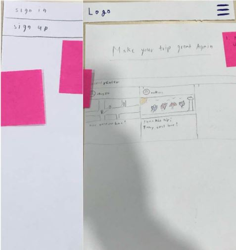
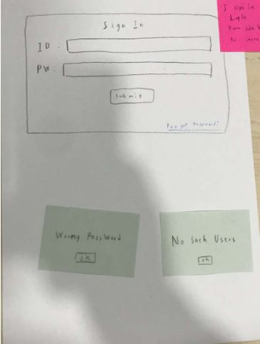
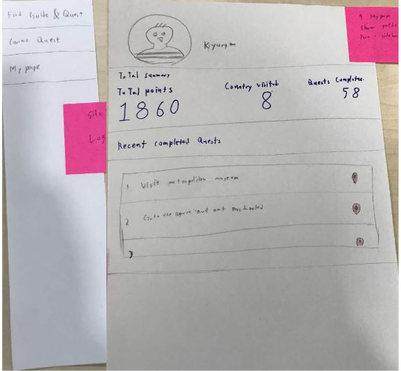
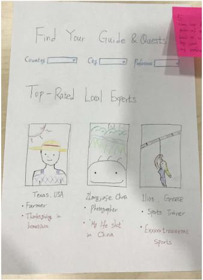
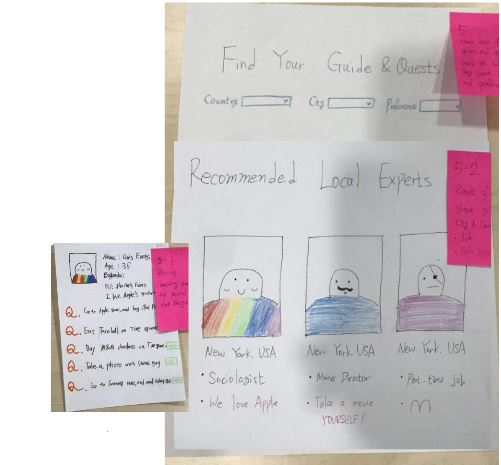
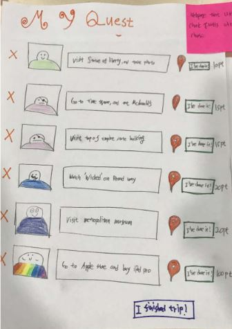
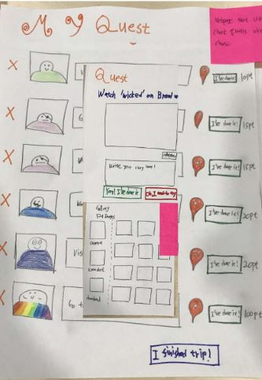
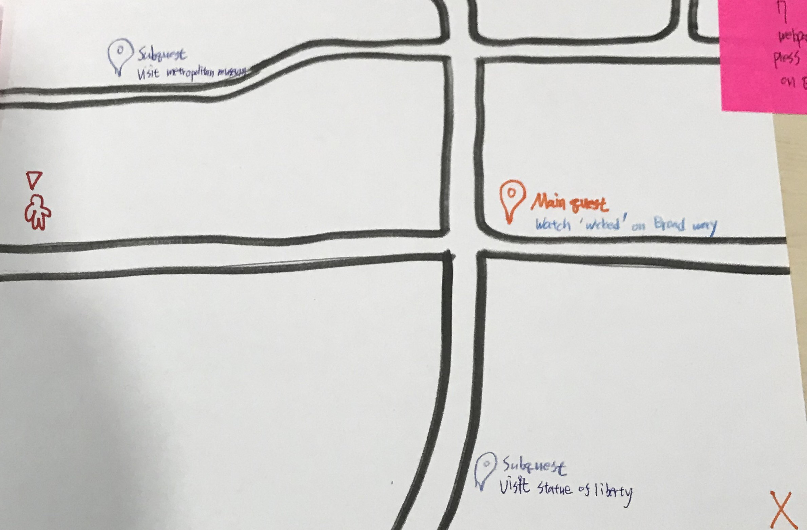
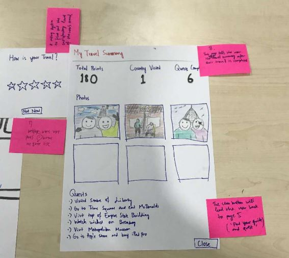

# DP3 Report

- Team name : IKs

- Team member : Kyungmo Kim, Hajun Kim, Minyeop Choi, Yoseph Kurnia Soenggoro

  

## Prototype

First page of our website. If the user clicks hamburger button on top right, then user can see 'sign in ' and 'sign up' button

If the user click 'sign in' button, then the user is moved on log in page

If the user click 'sign up' button, then the user can fill out basic sign up form

After the user made their own account or sign in, the could check their profile. And menu bar on the left changed to 'Find Guide& Quest' , 'Current quest' and 'My page'

In 'Find Guide & Quest' on the menu, User can find local experts by adding filter of country, city, and preference. Information about top rated local experts is shown on the bottom of the web page.

If user fill in these filters, the web page shows recommended local experts. If user click person's image, they can check the profile of local experts, and add quests made by them.

Since user have chosen their quests, they could check them on 'My Quest' menu. When the user accomplished the quest, they can submit pictures and simple diary by clicking ' I've done it!' button. 

If the user click the red button beside ' I've done it!' button, they can check their current location, and quests venue on Google map.

Finally, if the user thinks that her/his trip is finished, then user press 'I finished trip!' button. Then web page shows the quest result, photos which were uploaded by the user, and brief summary of the trip. 

## Participants

Total 3 participants 

Yoseph, Minyeop, and Kyungmo told each participant to come. 

#### Participant 1

- French, 21 year old, Male
- KAIST Exchange Student studying Business & Finance
- Travel twice a year
- Likes to sightsee

#### Participant 2

- Japanese, 23 year old, Male
- KAIST Exchange student, major in Business Management
- Travel twice a year
- Likes to take a photo

#### Participant 3

- Korean, 23 year old, Female
- KAIST student, 4th grade and Major in CS
- Travel once/twice a year
- Likes to explore the local culture and historical sites

## Briefing

Thanks for participating!

We will show you a **paper prototype** of our project. We want you to test it by doing the **tasks.**

The purpose of our service is making trips more fun with achieving the quests while traveling. What you can do in our service are **choose quests** made by local people, **achieve** those quests while you travel, and **check** the travel and quests you tried.

Let’s assume that you are in the trip sight, and begin to use our website.

## Tasks

**1. Search & Select Quests**

Choose one of the approved local people’s picture, then open and watch their profile and choose quests

**2. Complete Quests**

Check the chosen quest, and accomplished quest

Upload your photo as proof of completion of the task

**3. Follow your track of the trip**

Follow your whole journey and memorize it

## Observations

**Task1: choose one of the approved local people’s picture, then open and watch their profile and choose quests**

1. Couldn’t remember the difference between sign in and sign up and couldn’t find the way how he can view the sidebar.

   Participant : P1

   Criticality : Low

   Solution : Provide a logo for sign up and sign in to make users to clearly understand what it is. Provide a sidebar automatically when the user first enters the website.

   

2. Couldn’t recognize what the “Review from Others Panel” in the home page means. It also lacked implementation.

   Participant : P2, P3

   Criticality : Low

   Solution : It was due to lack of handwriting skills and implementations. We will provide implementations later. 

   

3. Had no “Search” or “Complete” button to click in our “Find Your Guide & Quest” screen after filling in the existing form in the page. Some couldn’t even recognize that it was about searching at first. 

   Participant : P1, P2, P3

   Criticality : High

   Solution : Make “Search” button at below. 

   

4. Had a problem while selecting the expert, as if there was no indication of what to do with the search result “Recommended Local Expert”. 

   Participant : P2

   Criticality : Medium

   Solution : Perhaps it is essential that we give more affordance in later development like providing feelings of buttons.

   

5. Could not understand the quest description because the quest interface shown is only limited to simple sentence describing the quest content instead of an image related to what he should do for the quest.

   Participant : P2

   Criticality : Medium

   Solution : It was a very great suggestion after he read and asked questions to our facilitator. We can provide an image related to what he should do for the quest as he suggested.

   

6. Confused questions with quests by looking at “Q” mark.

   Participant : P2

   Criticality : Medium

   Solution : This was unexpected, but fairly reasonable. We should invent a quest symbol or replace it to the word “Quest”.

   

**Task2: check the your quest, and suppose you accomplished your quest. Then upload your photo as proof of completion of the task**

1. Didn’t know the functionality of “I’ve done it” button In “My Quest” page because it was already colored green. 

   Participant : P1

   Criticality : Medium

   Solution : Change its color into blue and change the message into “Submit”.

   

2. Felt the path from “Quest” pop up to “My Quest” page inconvenient and complex.

   Participant : P1, P2

   Criticality : High

   Solution : Give a system message or notification that the quest is registered. Provide signals (e.g. include an arrow pointing to sidebar in notification) that users can access quest list via sidebar.

   

3. Felt that cross buttons in front of listed quests in “My Quest” page were confusing in terms of its functionality. He confused it with the concept of completion. 

   Participant : P1

   Criticality : Medium

   Solution : We can color the panel red if the user puts cursor to the button. We can also provide a warning message before removing the quest from quest list. 

   

4. Frequently lost what he should do next because of the lack of notification of the current context. 

   Participant : P1, P3

   Criticality : High

   Solution : Provide a progress bar to indicate where the user is currently in.

   

5. Wanted to modify the submission because of the typo but he couldn’t. 

   Participant : P3

   Criticality : Low

   Solution : We didn’t thought about this but we can add this flow to the storyboard.

   

6. Pointed out that categorization is needed among quests per travel.

   Participant : P3

   Criticality : High

   Solution : As we designed to show “My Travel Summary” for each travel, this functionality is necessary. We need to make a whole new design in “My Quest” page to include functionality of grouping among quests. 

   

**Task3: Follow your whole journey and memorize it**

1. Wanted to see the photos taken and the travel summaries from their previous travel in the “ My page” instead of the lists of quests that they have completed. In other words, the user prefer that their profile page could function as their travel diary.

   Participant : P2, P3

   Criticality : High

   Solution : Provide list of images the user had uploaded in “My page” with the quest completed. 

   

2. Felt “Points” given as a reward of traveling unnecessary because of the lack of explanations of what the users can do with “Points”. 

   Participant : P2

   Criticality : Low

   Solution : Perhaps providing system message or notification of what the users can do with “Points” would be great. Tutorial for “Points” system after signing up might be a great idea. Also we didn’t make enough discussions about how to reward based on points the users got yet. We will add features after it is fixed.  

   

## Individual Reflections

* Kyungmo : facilitator

* Minyeop: computer

* Hajun : observer
* Yoseph: observer

## Studio Reflections 

1. I wish to know prototype cased by tasks.

   : True. It would be better if we add one line of sentence to indicate what tasks are done in prototype slide.

   

2. You had added pictures next to the problems so we could see where the problems were. 

   : It will be more effective if we shows pictures while explaing problems. However, we did not have enough time to show pictures while explaining problems. 

   

3. Task be more specific/descriptive, what is quests about?

   : Some participants are also confused about the term 'quest' . It would be better if we add one line of description about the quest.

   

4. Task3: check my page & history -> function-level. It should be described in user-level.

   : After taking this feedback, we changed task3 to 'Follow your track of the trip'

   

5. check the travel and quests you tried ?

   : We also get this feedback from participant 2. In our future implementation, we will change profile web page that user can check their previous travels and quests.

   

7. just pick some important observations to present?

   : True. We wanted to show detailed observation result, but it took too much time.

   

9. What are the rewards for the local guides

   : Since our target user is about traveler, we did not explained about local guides. Obviously, local guides are also our user. Therefore, we need to make another service for local people who can earn money by providing quests.

   

10. How are photos validated?

    : Our first idea was when travelers upload their photos, then local people who gave this quest checks it. or we can use geo-tagged photos to verify them.

    

11. what you wrote as an individual reflection is ‘observation’. When writing a report, individual reflection should be about individual experience of running/organizing observation.

    : After taking this feedback, we introduce our impressions while showing paper prototype to the participant.

